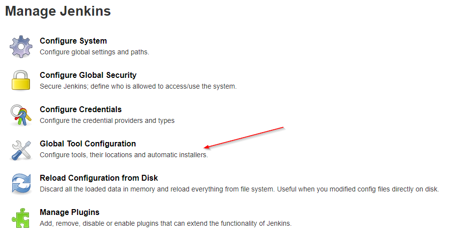
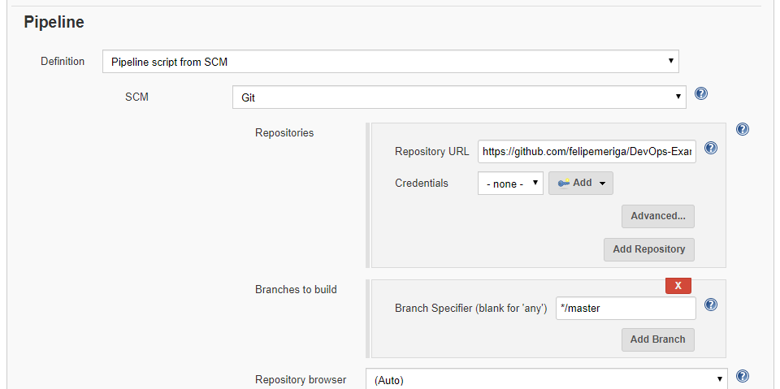

$ docker image build -t jenkins-docker .
$ docker container run -d -p 8585:8080 -v /var/run/docker.sock:/var/run/docker.sock jenkins-docker

To access the container run the following command:

$ docker exec -it <your_container_name> /bin/bash
And get the initial admin password:

$ cat /var/jenkins_home/secrets/initialAdminPassword

Further, select install suggested plugins, and the Jenkins will download automatically the basic plugins.

Jenkins Global Configurations
First of all we will have to configure the JDK, Maven and GIT in the global configurations in order to enable Jenkins to build the application,
and clone the code from the repository. So, in the Jenkins console, go to Manage Jenkins, and after that Global Tool Configuration.

JDK
We will use the open jdk that comes embedded with the Jenkins container, and the JDK directory will be located in /usr/lib/jvm/java-8-openjdk-amd64.
Then, point out the path of your JDK installation inside container,

Maven
Instead of point a maven directory on the system, we will tell Jenkins to download the Maven from apache servers. Therefore, just set it like the image bellow:

The Pipeline
Now that everything is set up, we can move to the pipeline. In Jenkins, you have the option to write the pipeline in the console, or let jenkins to find it in our git repository.
You just have a file called Jenkinsfile in the root path of the repository.

Jenkins Pipeline (or simply "Pipeline" with a capital "P") is a suite of plugins which supports implementing and integrating continuous delivery pipelines into Jenkins.

A continuous delivery (CD) pipeline is an automated expression of your process for getting software from version control right through to your users and customers.
Every change to your software (committed in source control) goes through a complex process on its way to being released. This process involves building the software in a reliable
and repeatable manner, as well as progressing the built software (called a "build") through multiple stages of testing and deployment.

Pipeline provides an extensible set of tools for modeling simple-to-complex delivery pipelines "as code" via the Pipeline domain-specific language (DSL) syntax.

The definition of a Jenkins Pipeline is written into a text file (called a Jenkinsfile) which in turn can be committed to a project’s source control repository.
This is the foundation of "Pipeline-as-code"; treating the CD pipeline a part of the application to be versioned and reviewed like any other code.

Creating a Jenkinsfile and committing it to source control provides a number of immediate benefits:

Automatically creates a Pipeline build process for all branches and pull requests.
Code review/iteration on the Pipeline (along with the remaining source code).
Audit trail for the Pipeline.
Single source of truth for the Pipeline, which can be viewed and edited by multiple members of the project.
Then, let's create the pipeline from our git repository. Just hit new item, give it a name and select pipeline. You will reach the section to configure, your pipeline,
you just have to inform Jenkins that your domain-specific-language file(Jenkinsfile) is under your git root directory.

Now let's check the pipeline code, and further test it.

node {
// reference to maven
// ** NOTE: This 'maven-3.0.5' Maven tool must be configured in the Jenkins Global Configuration.   
def mvnHome = tool 'maven-3.0.5'

	    // holds reference to docker image
	    def dockerImage
	    // ip address of the docker private repository(nexus)
	 
	    def dockerImageTag = "devopsexample${env.BUILD_NUMBER}"
	    
	    stage('Clone Repo') { // for display purposes
	      // Get some code from a GitHub repository
	       git branch: 'main', credentialsId: 'github-cred', url: 'https://github.com/tuyennv1983/springboot-security.git'
	      // Get the Maven tool.
	      // ** NOTE: This 'maven-3.0.5' Maven tool must be configured
	      // **       in the global configuration.           
	      mvnHome = tool 'maven-3.0.5'
	    }    
	  
	    stage('Build Project') {
	      // build project via maven
	      //sh "'${mvnHome}/bin/mvn' clean install"
	    }
			
	    stage('Build Docker Image') {
	      // build docker image
	      //dockerImage = docker.build("devopsexample:${env.BUILD_NUMBER}")
	    }
	   
	    stage('Deploy Docker Image'){
	      
	      // deploy docker image to nexus
			
	      echo "Docker Image Tag Name: ${dockerImageTag}"
		  
		  //sh "docker stop devopsexample"
		  
		  //sh "docker rm devopsexample"
		  
		  //sh "docker run --name devopsexample -d -p 2222:2222 devopsexample:${env.BUILD_NUMBER}"
		  
		  // docker.withRegistry('https://registry.hub.docker.com', 'docker-hub-credentials') {
	      //    dockerImage.push("${env.BUILD_NUMBER}")
	      //      dockerImage.push("latest")
	      //  }
	      
	    }
}

As can be seen in the pipeline code above, we have a bunch of steps, first of all we will:

Define some variables and clone the repository.
Execute the created tests.
Build the Spring Boot using the maven plugin, to generate the jar.
If the build is concluded, it will build the docker image and will stop the current running docker container, running the new one.
Starting the Pipeline
Now we can start the pipeline execution hiting Build Now.

No alt text provided for this image
Now the pipeline will start to run, and after some minutes will be concluded. Besides, one important thing to be pointed out,
is the fact that this example is related to academic purposes only, note that is not a recommended way of building a pipeline, because we are stopping a docker container,
and after this running the new one, besides that we are not managing any cluster, which brings us to 0% of availability when we are applying a patch.
